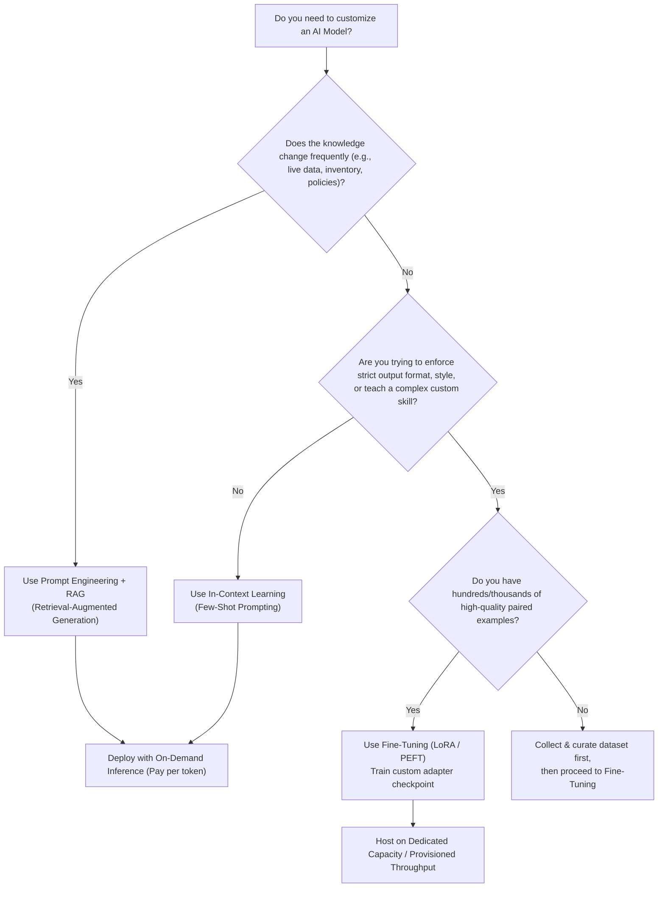

# 🤖 AI Technical Guide: Inference vs. Fine-Tuning

A comprehensive technical comparison covering internal mechanics, parameter updates (Full vs. PEFT/LoRA), cloud hosting & pricing models (e.g., AWS Bedrock), and architectural decision-making.

---

## 📑 Table of Contents
1. [Core Corrections & Clarifications](#1-core-corrections--clarifications)
2. [Inference vs. Fine-Tuning: Comprehensive Comparison](#2-inference-vs-fine-tuning-comprehensive-comparison)
3. [Detailed Technical Deep-Dive](#3-detailed-technical-deep-dive)
   - [A. What is Inference?](#a-what-is-inference)
   - [B. What is Fine-Tuning?](#b-what-is-fine-tuning)
4. [Architectural Decision Matrix](#4-architectural-decision-matrix)
   - [Decision Flowchart](#decision-flowchart)
   - [When to Choose RAG vs. Fine-Tuning](#when-to-choose-rag-vs-fine-tuning)

---

## 1. Core Corrections & Clarifications

### 📊 Input Data Size for Fine-Tuning
* **Misconception:** Requires a massive training dataset with tens of thousands of samples.
* **Correction:** With modern techniques like **LoRA / PEFT** (Parameter-Efficient Fine-Tuning) or instruction tuning, you often only need **a few hundred to a few thousand high-quality examples**. Massive multi-terabyte datasets are required for *pre-training from scratch*, not fine-tuning.

### 🧠 How Weights Are Updated
* **Full Fine-Tuning:** All base model parameters (\(100\%\) of weights) are modified.
* **PEFT / LoRA (Industry Standard):** The original base model weights remain **frozen**. Only a tiny set of added adapter parameters (\(\sim 0.1\% - 1\%\)) are trained and merged, drastically saving compute and memory.

### 💰 Inference & Hosting Costs (AWS Bedrock & Cloud)
* **Standard Base Models:** Billed on a serverless, **pay-per-token** model (input/output tokens).
* **Fine-Tuned Custom Models:** On enterprise platforms like AWS Bedrock, serving a fine-tuned custom model often requires purchasing **Provisioned Throughput** (dedicated model units), which incurs a fixed hourly baseline cost regardless of request volume.

### ⚙️ Internal Mechanics
* **Inference:** **Forward pass only**. Generates token probabilities without tracking gradients or allocating memory for backpropagation.
* **Fine-Tuning:** **Forward pass + Loss calculation + Backpropagation + Gradient Descent**. Computes weight updates across layers or adapter matrices.

---

## 2. Inference vs. Fine-Tuning: Comprehensive Comparison

| Feature | ⚡ Inference (Execution) | 🎯 Fine-Tuning (Training / Adaptation) |
| :--- | :--- | :--- |
| **What it is** | Running an existing model to generate predictions, text, or decisions. | Adapting an existing model's parameters to a specific task, domain, or tone. |
| **Primary Goal** | Perform a task or answer a prompt using pre-existing knowledge. | Customize model behavior, formatting consistency, tone, or domain terminology. |
| **Input Required** | A single prompt / query (text, images, instructions, context). | A curated dataset of prompt-completion pairs (often in `.jsonl` format). |
| **Dataset Size** | **1 prompt** (with optional RAG context). | **Hundreds to thousands** of high-quality examples (quality > quantity). |
| **Internal Process** | **Forward pass only:** Generates next tokens sequentially using fixed weights. | **Forward & backward passes:** Computes gradients and updates weights / adapter layers. |
| **Model Weights** | ❌ **Frozen / Unchanged** | ✅ **Updated** (Full fine-tuning) or **New Adapter Layers Added** (LoRA/PEFT). |
| **Execution Mode** | Real-time (streaming/API) or Batch Inference. | Asynchronous, offline batch training job. |
| **Latency / Time** | Milliseconds to seconds per request. | Minutes to hours/days (one-time job depending on dataset & GPU cluster). |
| **Output** | Generated response (text, structured JSON, embeddings). | A new model checkpoint or adapter weights artifact. |
| **Pricing Model** | On-Demand (pay per token) or Provisioned Capacity. | Training compute cost (GPU-hours) + Dedicated hosting / Provisioned Throughput. |
| **AWS Bedrock Support** | `InvokeModel` / `Converse` APIs (On-Demand / Provisioned). | Bedrock Custom Models (fine-tuning Amazon Titan, Meta Llama, Cohere Command, etc.). |
| **Analogy** | Consulting a trained specialist to answer a specific question. | Sending that specialist through an intensive workshop to adapt to your company's exact workflow. |

---

## 3. Detailed Technical Deep-Dive

### A. What is Inference?
Inference is the live operational phase where an AI model applies what it learned during training:

1. **Tokenization & Embeddings:** The input string is converted into integer tokens, which are projected into high-dimensional vectors.
2. **Transformer Processing:** Tokens flow through multi-head self-attention mechanisms and feed-forward layers.
3. **Sampling:** Output logits are transformed via Softmax into probabilities. Techniques like temperature, Top-P, and Top-K guide token selection until an end-of-sequence (`<EOS>`) token is hit.

#### Key Inference Optimizations:
* **KV-Caching:** Stores previously calculated Key and Value tensor representations in GPU VRAM so attention is not recalculated for preceding tokens on every step.
* **Quantization:** Reduces parameter precision (e.g., FP16 \(\rightarrow\) INT8 / FP8 / INT4) to decrease VRAM footprint and increase token throughput.
* **Speculative Decoding:** Uses a small, fast draft model to speculate several tokens ahead, with the larger target model verifying them in parallel.

---

### B. What is Fine-Tuning?
Fine-tuning is a supervised transfer learning process that adjusts model parameters:

1. **Supervised Fine-Tuning (SFT):** The model is trained on curated input-output pairs formatted as:
   ```json
   {"prompt": "Convert user request to SQL: Get total revenue for 2025", "completion": "SELECT SUM(revenue) FROM sales WHERE year = 2025;"}
   ```
2. **Parameter-Efficient Fine-Tuning (PEFT / LoRA):**
   * Instead of modifying all \(W_0 \in \mathbb{R}^{d \times k}\) weights, LoRA freezes \(W_0\) and trains two low-rank decomposition matrices \(A\) and \(B\) such that:
     $$\Delta W = B \times A \quad \text{where } r \ll \min(d, k)$$
   * Reduces trainable parameters by up to **\(99\%\)** and cuts VRAM training overhead by up to **\(80\%\)**.
3. **Continued Pre-training:** Training an existing foundation model on large amounts of raw, unlabelled text to inject deep domain vocabulary (e.g., specialized medical, legal, or regional language corpora).

---

## 4. Architectural Decision Matrix

### Decision Flowchart



---

### When to Choose What?

#### ✅ Choose Standard Inference + RAG when:
* Your data changes regularly (e.g., news, product documentation, customer database).
* You must cite exact sources and prevent hallucinations with verifiable references.
* You need fast time-to-market with minimal upfront compute cost.

#### ✅ Choose Fine-Tuning when:
* You require a strict, unbreakable output structure (e.g., specialized DSLs, rigid JSON/XML schemas).
* You want to reduce prompt token usage (baking few-shot examples into the weights instead of repeatedly sending long system prompts).
* You want a smaller, cost-effective model (e.g., 8B parameters) to match the accuracy of a massive model (e.g., 70B parameters) on a specialized task.
* You want to instill a distinctive brand voice, persona, or tone that prompt instructions fail to maintain consistently.
